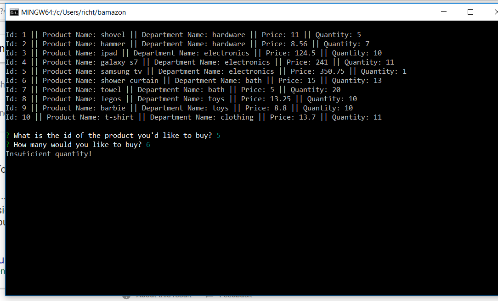
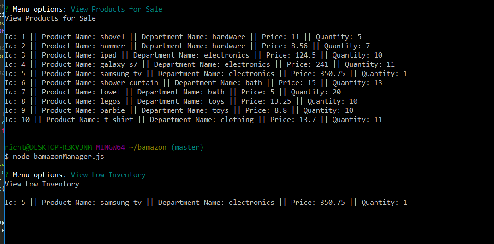
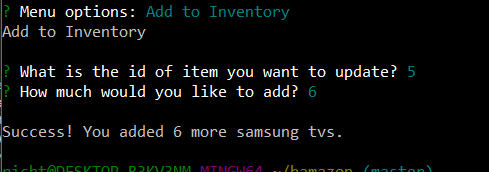
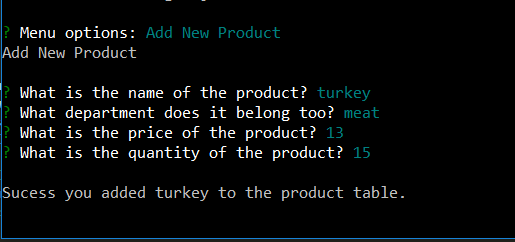
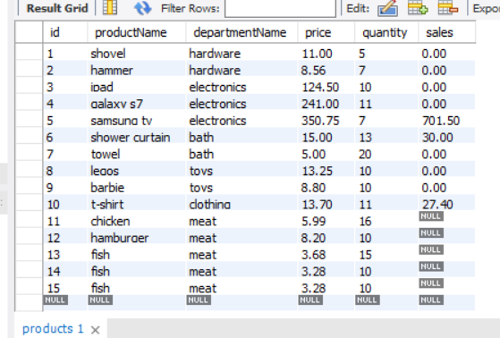

#  bamazon

### Overview

Command line Node.js app that hosts products for purchase on a MySQL database. Complete with customer, manager and supervisor access rights.

### Customer View

#### Would you like to buy?

#### Insufficient funds.

### Manager View

#### View products / view low products.

#### Add inventory.

#### Add new product.

### Supervisor View

#### View table.

#### Add new department.

### MySQL Tables

#### Product table.

#### Department table.

### Core Technology

- MySQL

